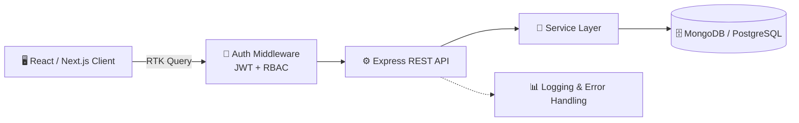

<!-- ========================= HEADER ========================= -->
<div align="center">


<a href="https://github.com/jahid45780">
  
</a>

<br/><br/>


<br/><br/>

<a href="https://github.com/jahid45780"></a>
<a href="https://www.linkedin.com/in/md-jahid-91589a295"></a>
<a href="mailto:mdjahidhossain88899@gmail.com"></a>
<a href="https://mdjahid-hossaion.vercel.app"></a>

</div>

<br/>

<!-- ========================= ABOUT ========================= -->
## 👨‍💻 About Me

> I build **reliable, scalable and user-friendly web applications** — from responsive interfaces to secure REST APIs and well-designed database architectures. I care about the parts users never see: **clean code, solid security and performance.**

<table>
<tr>
<td width="55%" valign="top">

```javascript
const jahid = {
  name: "MD Jahid Hossain",
  role: "Full-Stack Developer",
  specialization: "Backend-Focused MERN Engineer",
  location: "Dhaka, Bangladesh 🇧🇩",

  stack: {
    frontend: ["React", "Next.js", "TypeScript", "Redux Toolkit", "Tailwind CSS"],
    backend:  ["Node.js", "Express.js", "MongoDB", "PostgreSQL", "Prisma"],
  },

  focus: [
    "Backend Architecture",
    "REST API Development",
    "Authentication & Authorization",
    "Database Design",
    "Performance Optimization",
  ],

  currentlyLearning: ["System Design", "Redis & Caching", "Cloud & DevOps"],
  openTo: ["Collaboration", "Open Source", "Interesting Ideas"],

  funFact: "I love turning ideas into real-world applications 🚀",
};
```

</td>
<td width="45%" valign="top">

### ⚡ Quick Facts

- 🔭 Building **production-ready** full-stack apps
- 🔐 Deep focus on **auth, roles & security**
- 🗄️ Designing **clean database schemas**
- 🌱 Learning **System Design & DevOps**
- 🤝 Open to **collaboration & open-source**
- 📫 Reach me: **mdjahidhossain88899@gmail.com**

<br/>


</td>
</tr>
</table>

---

<!-- ========================= TECH STACK ========================= -->
## 🛠️ Tech Stack

<div align="center">

**🎨 Frontend**


**⚙️ Backend & Database**


**🔧 Tools & Platforms**


</div>

<br/>

<div align="center">

| Area | Technologies |
| :--- | :--- |
| 🌐 **Frontend** | React · Next.js · TypeScript |
| ⚙️ **Backend** | Node.js · Express.js |
| 🗄️ **Database** | MongoDB · PostgreSQL · Prisma · Mongoose |
| 🔐 **Authentication** | JWT · Cookies · Role-Based Access Control |
| 🎨 **UI** | Tailwind CSS · shadcn/ui |
| 🔄 **State Management** | Redux Toolkit · RTK Query |
| 🧪 **API Testing** | Postman |
| 🚀 **Deployment** | Vercel · Docker |

</div>

---

<!-- ========================= ARCHITECTURE ========================= -->
## 🧠 How I Structure My Apps



---

<!-- ========================= PROJECTS ========================= -->
## 📌 Featured Projects

<table>
<tr>
<td width="50%" valign="top">

### 🧳 Tour Management System
A full-stack tour booking platform with modern frontend architecture and a secure backend API.

- 🔐 Authentication & Authorization
- 👥 Role-based user management
- 🧳 Tour & package management
- 🔎 Search & filtering
- 📱 Responsive UI · ⚡ REST API

`React` `TypeScript` `Node.js` `Express` `MongoDB` `RTK Query` `Tailwind CSS`

</td>
<td width="50%" valign="top">

### 💳 Digital Wallet API
A backend-focused wallet system built for secure financial operations and role-based access.

- 🔐 JWT Authentication
- 👤 User / Admin / Agent roles
- 💰 Wallet management
- 🔄 Transaction handling
- 🛡️ Authorization middleware

`Node.js` `Express.js` `TypeScript` `MongoDB` `Mongoose`

</td>
</tr>
<tr>
<td width="50%" valign="top">

### ⚽ 7UP Live Sports
A modern sports platform for live football streaming, live scores and IPTV content.

`Next.js` `TypeScript` `Tailwind CSS` `Vercel`

</td>
<td width="50%" valign="top">

### 🚧 Next Up
Exploring **Redis caching, Docker & CI/CD** to build faster, more scalable production systems.

`Redis` `Docker` `CI/CD` `PostgreSQL` `Prisma`

</td>
</tr>
</table>

<div align="center">
<a href="https://github.com/jahid45780?tab=repositories"></a>
</div>

---

<!-- ========================= CORE SKILLS ========================= -->
## 💡 Core Strengths

<div align="center">


</div>

---

<!-- ========================= STATS ========================= -->
## 📊 GitHub Analytics

<div align="center">

<a href="https://github.com/jahid45780">
  
</a>
<a href="https://github.com/jahid45780">
  
</a>

<br/><br/>

<a href="https://github.com/jahid45780">
  
</a>

<br/><br/>


<br/>


</div>

---

<!-- ========================= GOALS ========================= -->
## 🎯 Goals & Learning Path

<table>
<tr>
<td width="50%" valign="top">

### 🎯 Current Goals
- 🚀 Build production-ready full-stack apps
- ⚡ Improve backend performance & scalability
- 🔐 Master advanced security practices
- 🧠 Strengthen system design knowledge
- ☁️ Explore Cloud & DevOps
- 🌍 Contribute to open source

</td>
<td width="50%" valign="top">

### 📚 Currently Learning
```text
▸ System Design
▸ Advanced Node.js
▸ PostgreSQL & Prisma
▸ Redis & Caching
▸ Docker & CI/CD
▸ Cloud Architecture
```

</td>
</tr>
</table>

---

<!-- ========================= PHILOSOPHY ========================= -->
## ⚡ Developer Philosophy

<div align="center">

> **"Write clean code. Build scalable systems. Keep learning."**

Great software isn't just about making things work —
it's about making them **secure, maintainable, scalable and easy to understand.**

</div>

---

<!-- ========================= CONNECT ========================= -->
## 🤝 Let's Connect

<div align="center">

### 💬 Have an idea or want to collaborate?

I'm always up for conversations about **web development, backend engineering, open source and exciting ideas.**

<a href="mailto:mdjahidhossain88899@gmail.com"></a>
<a href="https://mdjahid-hossaion.vercel.app"></a>
<a href="https://www.linkedin.com/in/md-jahid-91589a295"></a>

<br/><br/>

### 💻 Code • Build • Scale • Repeat 🚀


</div>
